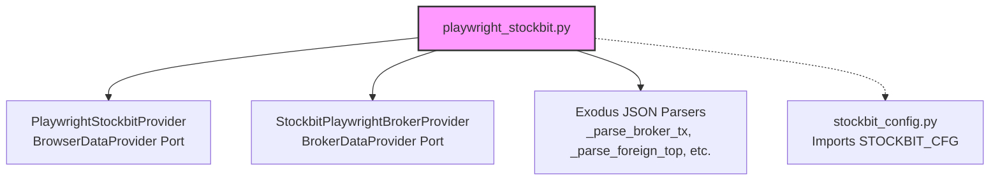

# Code Extraction & Architectural Refactoring Recommendations

**Date:** June 21, 2026  
**Document ID:** agy_extraction_recommendation_190626  
**Author:** Antigravity (Senior AI Development Agent)  
**Context:** Codebase-wide review of file sizes, layer boundaries, and hexagonal design compliance (enforcing the *Adapter Thinness Rule* and *DRY principles*), updated to reflect the latest configuration changes.

---

## 1. Executive Summary

This document outlines structural recommendations for refactoring and extracting logic from large files in the `ai-saham` application. The primary objectives are:
1. **Enforce Layer Separation:** Protect the Domain from I/O and keep adapters strictly limited to input parsing and output formatting.
2. **Eradicate Code Duplication:** Consolidate mathematical indicator calculations and backtest performance metric aggregators.
3. **Enhance Testability and Maintainability:** Break massive infrastructure files into focused, cohesive classes that are easy to mock and extend.

---

## 2. Extraction Recommendation Summary

| Target File / Module | Current Size | Category | Proposed Action | Status | Target Architecture Layer |
| :--- | :--- | :--- | :--- | :--- | :--- |
| `playwright_stockbit.py` | 2,391 lines | Cohesion & Port Splitting | Remove duplicate configuration logic (import `STOCKBIT_CFG`); extract Exodus JSON parsers into a separate file; split browser-movers and broker-flow providers. | **Config Done** (Commit `5e576fd`) / **Pending Parser Split** | Infrastructure |
| CLI Commands (`swing_commands.py`, `intraday_workflow_commands.py`, `accumulation_commands.py`) | 1,300 - 1,500 lines each | Adapter Thinness | Relocate remaining display panel formatting and ASCII tables to existing display modules; shift refresh/fetch decisions to Application. | **In Progress** (Commit `803ef69` thinned `fetch_market_commands.py`) | Adapter (CLI) |
| Inlined Indicators (`accumulation_screen.py`, `intraday_backtest.py`) | 800 - 950 lines each | Logic Leaks & Duplication | Replace custom inline indicator math (RSI, Bollinger Bands, SMA) with central `IndicatorRegistry` / Formula DSL evaluation. | **Pending** | Application $\rightarrow$ Domain |
| Backtest Metrics (`swing_backtest.py`, `intraday_backtest.py`) | N/A (duplicated) | DRY Violation | Extract duplicate calculators (`_max_drawdown`, `_profit_factor`, `_expectancy`) to a unified domain metrics service. | **Pending** | Domain |

---

## 3. Detailed Candidate Analysis

### Candidate 1: `src/infrastructure/browser/playwright_stockbit.py`
This file implements two distinct data ports (`BrowserDataProvider` and `BrokerDataProvider`) and embeds massive parsing blocks for different Stockbit Exodus JSON API endpoints.

* **Proposed Solution**: 
  1. **Clean up Configuration Duplication:** Remove the duplicate dataclass `_StockbitConfig` and function `_load_stockbit_config` in `playwright_stockbit.py`. Replace them with imports from the newly created [stockbit_config.py](file:///Users/satriyo/dev/ai-saham/src/infrastructure/config/stockbit_config.py) (`STOCKBIT_CFG`).  
     * **Status:** **✅ Done** in Commit `5e576fd`. Local configuration was deleted and replaced by a direct import of the singleton `STOCKBIT_CFG`.
  2. **Extract JSON Parsers (Pending):** Extract all helper functions parsing Exodus JSON data into a separate utility module: [stockbit_parsers.py](file:///Users/satriyo/dev/ai-saham/src/infrastructure/browser/stockbit_parsers.py).
  3. **Split Providers (Pending):** Split the file into:
     - `src/infrastructure/browser/playwright_stockbit_browser.py` (implements `BrowserDataProvider`)
     - `src/infrastructure/browser/playwright_stockbit_broker.py` (implements `BrokerDataProvider`)

#### Alternatives Comparison
* **Option A: Full Extraction & File Split (Recommended)**
  * *Pros:* Clear single responsibility, file sizes decrease to under 600 lines, test mocks can target parsers directly.
  * *Cons:* Increases the number of files in the directory.
* **Option B: Only Extract Parsers (Partial Refactoring)**
  * *Pros:* Solves the immediate bloat (removes ~1,500 lines of helper code).
  * *Cons:* Keeps two separate ports bound to the same class file, leading to potential dependency drift.

#### Risk & Risk Management
* **Risk (Broken Integration / Endpoints):** Splitting files might accidentally break network interception or endpoint constants because they share the private module configuration.
* **Mitigation:**
  1. Use the new centralized config file [stockbit_config.py](file:///Users/satriyo/dev/ai-saham/src/infrastructure/config/stockbit_config.py) for all endpoint defaults, eliminating duplicate parsing config bugs.
  2. Ensure the Playwright smoke tests (`saham fetch stockbit test`) are run before and after extraction.
  3. Validate that JWT token interception routines still share session state cleanly.

---

### Candidate 2: Bloated CLI Adapters (`swing_commands.py`, `intraday_workflow_commands.py`, `accumulation_commands.py`)
These click/typer routers have grown significantly because they coordinate data fetches, determine cache freshness, format complex text blocks, and catch/print errors.

* **Proposed Solution**:
  1. **Clean up Configuration Loading:** Move any remaining inline YAML config files/parsers (like the legacy `_load_swing_screener_config` in `swing_commands.py`) to the infrastructure config module [swing_config.py](file:///Users/satriyo/dev/ai-saham/src/infrastructure/config/swing_config.py). Note that data source config has already been thinned out (the recent extraction of `_broker_summary_source` from [fetch_market_commands.py](file:///Users/satriyo/dev/ai-saham/src/adapters/cli/fetch_market_commands.py) to [data_sources_config.py](file:///Users/satriyo/dev/ai-saham/src/infrastructure/config/data_sources_config.py) in Commit `803ef69` / `5e576fd` proves the effectiveness of this approach).
  2. **Move Remaining Presentation Blocks:** Existing display adapters (like `swing_display.py`, `swing_broker_display.py`, `swing_analysis_display.py`, and `accumulation_display.py`) contain the majority of terminal formatting code. However, several formatting helpers (`_fmt_optional_float`, `_print_swing_output`, `_display_confirmations`) are still embedded locally in the CLI adapter scripts and should be moved.
  3. **Relocate Cache Caching/Workflow Decisions:** Relocate cache freshness checks (`_build_data_freshness`) and automatic refresh coordination (`_auto_refresh_swing_data`) out of `swing_commands.py` and put them inside an Application service.

#### Alternatives Comparison
* **Option A: Pure Adapter Thinness Compliance (Recommended)**
  * *Pros:* Adapters strictly route inputs and display results, aligning with Hexagonal architecture; easier to test use cases without command wrappers.
  * *Cons:* Requires shifting output data-structures to detailed DTOs instead of raw dictionary passing.
* **Option B: Extract Only Display Code (Status Quo Maintenance)**
  * *Pros:* Shrinks CLI files immediately.
  * *Cons:* Leaves caching policy and workflow decisions inside the adapter layer, violating `PROMPT_CONTRACT.md` (Section 5.1).

#### Risk & Risk Management
* **Risk (UI Display Regression):** Formatting extractions could break table sizing, alignment, or color schemes in terminal output.
* **Mitigation:**
  1. Keep the extracted display methods inside the adapter layer (e.g., `src/adapters/cli/display/`) so they still have access to formatting libraries like `Rich` and `Plotext`.
  2. Use string output comparisons (`saham analyze swing BBRI --format table`) during manual testing to ensure visual output matches exactly.

---

### Candidate 3: Inlined Technical Indicators (`accumulation_screen.py`, `intraday_backtest.py`)
Both the screen and backtest use cases contain custom inlined code for computing technical indicators (RSI, Bollinger Bands, SMA, trend direction, and support levels).

* **Proposed Solution**:
  * Replace the inlined calculation loops with calls to `src/application/services/indicator_registry.py` or use the compiled AST/Formula DSL engine, which is built to safely compile and run indicator logic.

#### Alternatives Comparison
* **Option A: Registry Delegation (Recommended)**
  * *Pros:* Ensures indicator calculations remain identical across screeners, command lines, and strategies; warm-up policies (Wilder's smoothing vs standard SMA seeds) are automatically respected.
  * *Cons:* May require converting custom candle structures into input lists recognized by the registry.
* **Option B: Inline Code Optimization (No Extraction)**
  * *Pros:* Avoids refactoring data inputs.
  * *Cons:* Risk-prone; could cause drift between how indicators compute in strategies vs screeners, violating ADR-007.

#### Risk & Risk Management
* **Risk (Mathematical Drift / Performance Drop):** Inline calculation is often slightly faster for large lists because it avoids registry lookup overhead. Furthermore, incorrect seeding or slicing could shift the resulting indicator values.
* **Mitigation:**
  1. Write explicit regression tests matching the output of the inline code with the registry outputs.
  2. Exclude warm-up zones explicitly when evaluating conditions.

---

### Candidate 4: Duplicated Backtest Metrics (`swing_backtest.py`, `intraday_backtest.py`)
Both files compute performance metrics (e.g., drawdown, average winning trades, expectancy, and win rate) independently.

* **Proposed Solution**:
  * Extract statistical computations to a domain service `src/domain/services/backtest_metrics.py` or a pure value object `BacktestStatistics`.

#### Alternatives Comparison
* **Option A: Pure Domain Helper (Recommended)**
  * *Pros:* Math formulas are isolated, reusable, and completely decoupled from execution flows (swing vs intraday).
  * *Cons:* Requires minor structural changes to backtest result schemas.
* **Option B: Use Third-Party Math Libraries (e.g., pandas / numpy)**
  * *Pros:* Fast calculation of standard deviations, drawdowns.
  * *Cons:* Violates the local-first, minimal dependency design; domain entities must remain pure.

#### Risk & Risk Management
* **Risk (Regression in Performance Reporting):** Changing metric calculation paths could break summary outputs or show minor deviations in rounding decimal numbers.
* **Mitigation:**
  1. Standardize statistics calculations to use Python's `Decimal` type to avoid floating-point rounding errors.
  2. Create a test fixture comparing the output of the new service with historical backtest outputs.

---

## 4. Prioritization & Action Plan

To manage risk and avoid introducing bugs, the refactoring should proceed in three distinct phases:

1. **Phase 1 (High Priority - High Impact):**
   * Relocate display logic out of the CLI adapters to their corresponding display sub-modules. This immediately resolves adapter bloat and simplifies the CLI commands without changing core calculations.
2. **Phase 2 (High Priority - Architecture Protection):**
   * **Clean up Configuration:** Consolidate configuration loading in [playwright_stockbit.py](file:///Users/satriyo/dev/ai-saham/src/infrastructure/browser/playwright_stockbit.py) by importing `STOCKBIT_CFG` (Done).
   * **Extract Parsers & Split Providers (Pending):** Refactor [playwright_stockbit.py](file:///Users/satriyo/dev/ai-saham/src/infrastructure/browser/playwright_stockbit.py) to extract the JSON parser helpers and split the browser/broker classes into separate files. Use the Playwright smoke tests to ensure no regressions.
3. **Phase 3 (Medium Priority - Math Correctness):**
   * Consolidate backtest metrics and technical indicator calculations to the Domain layer, updating screeners and backtest use cases to delegate calculation duties.
