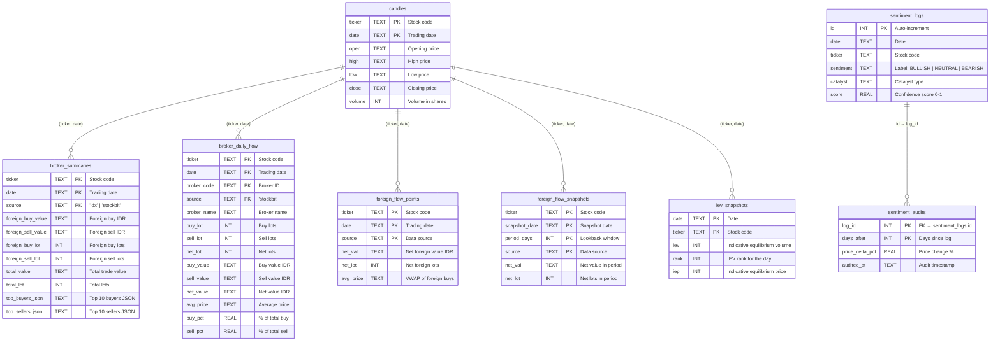

# Database ERD — data.db



## Table Relationships

| # | Table | Purpose | Key | Rows Are |
|---|-------|---------|-----|----------|
| 1 | **candles** | Daily OHLCV prices | `(ticker, date)` | One row per stock per trading day |
| 2 | **broker_summaries** | Aggregate foreign buy/sell per stock per day | `(ticker, date, source)` | One row per stock per day per source (idx + stockbit) |
| 3 | **broker_daily_flow** | Per-broker breakdown (granular) | `(ticker, date, broker_code, source)` | One row per broker per stock per day |
| 4 | **foreign_flow_points** | Time-series net foreign flow | `(ticker, date, source)` | One row per stock per day, used by VWAP / accum |
| 5 | **foreign_flow_snapshots** | Pre-computed period aggregates | `(ticker, snapshot_date, period_days, source)` | Cached result of N-day lookback |
| 6 | **iev_snapshots** | Pre-open IEV rankings | `(date, ticker)` | One row per stock per pre-open session |
| 7 | **sentiment_logs** | AI sentiment classifications | `id` | One row per classification event |
| 8 | **sentiment_audits** | Price outcome after sentiment | `(log_id, days_after)` | One row per audit point per log |

## Entity Groupings

```
MARKET DATA                          BROKER/FLOW DATA
┌──────────┐                         ┌───────────────────┐
│ candles  │────(ticker,date)───────▶│ broker_summaries  │
│ OHLCV    │                         │ aggregate foreign  │
└──────────┘                         └───────────────────┘
     │                                      │
     │(ticker,date)                    (ticker,date)
     ▼                                      ▼
┌──────────┐                         ┌───────────────────────┐
│ iev_     │                         │ broker_daily_flow     │
│ snapshots│                         │ per-broker (granular) │
└──────────┘                         └───────────────────────┘
                                              │
                                         (ticker,date)
                                              ▼
                                     ┌───────────────────────┐
                                     │ foreign_flow_points   │
                                     │ net flow time-series  │
                                     └───────────────────────┘
                                              │
                                         (ticker,date)
                                              ▼
                                     ┌──────────────────────────┐
                                     │ foreign_flow_snapshots    │
                                     │ pre-computed aggregates   │
                                     └──────────────────────────┘

SENTIMENT
┌────────────────┐
│ sentiment_logs │───(id)───▶│ sentiment_audits │
└────────────────┘           └──────────────────┘
```

## Notes

- No formal FK constraints exist (SQLite, app-enforced referential integrity).
- `(ticker, date)` is the universal join key across all market data tables.
- `broker_daily_flow` stores per-broker data from Stockbit; `broker_summaries` stores aggregate foreign flow from both IDX and Stockbit.
- `foreign_flow_points` is the canonical time-series for net foreign flow, computed from `broker_summaries`.
- `foreign_flow_snapshots` is a cache layer — pre-computed aggregates for faster swing screening queries.
