# Database ERD — data.db

21 tables total. All `Decimal` values stored as `TEXT` to avoid floating-point precision loss.
OHLCV volumes are stored in raw shares. Broker/foreign flow lots are stored as lots (÷100) in `_lot` columns.

```mermaid
erDiagram
    candles {
        ticker TEXT PK  "Stock code"
        date TEXT PK    "Trading date"
        open TEXT      "Opening price"
        high TEXT      "High price"
        low TEXT       "Low price"
        close TEXT     "Closing price"
        volume INT     "Volume in shares"
        created_at TEXT "Auto timestamp"
    }

    stock_meta {
        ticker TEXT PK     "Stock code"
        name TEXT          "Company name"
        sector TEXT        "Sector"
        sector_key TEXT    "Sector key"
        industry TEXT      "Industry"
        industry_key TEXT  "Industry key"
        source TEXT        "Source: yahoo | idx"
        fetched_at TEXT    "Fetch timestamp"
        checksum TEXT      "Data checksum"
    }

    broker_summaries {
        ticker TEXT PK          "Stock code"
        date TEXT PK            "Trading date"
        source TEXT PK          "idx | stockbit | csv-idx | csv-stockbit"
        foreign_buy_value TEXT  "Foreign buy IDR"
        foreign_sell_value TEXT "Foreign sell IDR"
        foreign_buy_lot INT     "Foreign buy lots"
        foreign_sell_lot INT    "Foreign sell lots"
        total_value TEXT        "Total trade value IDR"
        total_lot INT           "Total lots"
        top_buyers_json TEXT    "Top 10 buyers JSON (null if IDX)"
        top_sellers_json TEXT   "Top 10 sellers JSON (null if IDX)"
        created_at TEXT         "Auto timestamp"
    }

    foreign_flow_points {
        ticker TEXT PK    "Stock code"
        date TEXT PK      "Trading date"
        source TEXT PK    "idx | stockbit"
        net_val TEXT      "Net foreign value IDR"
        net_lot INT       "Net foreign lots"
        avg_price TEXT    "Avg price: 0 if IDX, exact if Stockbit"
        created_at TEXT   "Auto timestamp"
    }

    foreign_flow_snapshots {
        ticker TEXT PK          "Stock code"
        snapshot_date TEXT PK   "Snapshot date"
        period_days INT PK     "Lookback window"
        source TEXT PK          "Always stockbit"
        net_val TEXT            "Net value in period"
        net_lot INT             "Net lots in period"
        created_at TEXT         "Auto timestamp"
    }

    broker_daily_flow {
        ticker TEXT PK        "Stock code"
        date TEXT PK          "Trading date"
        broker_code TEXT PK   "Broker ID"
        broker_name TEXT      "Broker name"
        source TEXT PK        "Always stockbit"
        buy_lot INT           "Buy lots"
        sell_lot INT          "Sell lots"
        net_lot INT           "Net lots"
        buy_value TEXT        "Buy value IDR"
        sell_value TEXT       "Sell value IDR"
        net_value TEXT        "Net value IDR"
        avg_buy_price TEXT    "Avg buy price per share"
        avg_sell_price TEXT   "Avg sell price per share"
        avg_price TEXT        "Avg net price (dominant side)"
        buy_pct REAL          "Broker buy % of market"
        sell_pct REAL         "Broker sell % of market"
        created_at TEXT       "Auto timestamp"
    }

    iev_snapshots {
        date TEXT PK         "Date"
        ticker TEXT PK       "Stock code"
        iev INT              "Indicative equilibrium volume"
        rank INT             "IEV rank for the day"
        iep INT              "Indicative equilibrium price (nullable)"
        fetched_at TEXT      "Fetch timestamp"
        is_ncp_locked INT    "NCP locked flag"
    }

    iev_snapshot_history {
        id INT PK            "Auto-increment"
        date TEXT            "Date"
        ticker TEXT          "Stock code"
        iev INT              "IEV"
        rank INT             "Rank"
        iep INT              "IEP"
        collected_at TEXT    "Collection timestamp"
        is_ncp_locked INT    "NCP locked flag"
    }

    sentiment_logs {
        id INT PK          "Auto-increment"
        date TEXT          "Date"
        ticker TEXT        "Stock code"
        sentiment TEXT     "BULLISH | NEUTRAL | BEARISH"
        catalyst TEXT      "Catalyst type"
        score REAL         "Confidence score 0-1"
    }

    sentiment_audits {
        log_id INT PK      "FK to sentiment_logs.id"
        days_after INT PK  "Days since log"
        price_delta_pct REAL "Price change %"
        audited_at TEXT    "Audit timestamp"
    }

    ticker_notation_cache {
        ticker TEXT PK          "Stock code"
        status TEXT             "Company status"
        tradeable INT           "Is tradeable"
        listing_board TEXT      "Main | Development | Acceleration"
        sector TEXT             "Sector"
        sub_sector TEXT         "Sub-sector"
        haircut_percentage TEXT "Haircut %"
        notations_json TEXT     "Notation flags JSON"
        market_status TEXT      "Market status"
        suspend_info TEXT       "Suspension info"
        corp_action_active INT  "Active corporate action"
        has_uma INT             "UMA flag"
        catalogs_json TEXT      "Catalog entries JSON"
        source TEXT             "Always stockbit"
        fetched_date TEXT       "Fetch date"
        fetched_at TEXT         "Fetch timestamp"
    }

    analyst_cache {
        ticker TEXT PK       "Stock code"
        buy_count INT        "Buy ratings"
        hold_count INT       "Hold ratings"
        sell_count INT       "Sell ratings"
        avg_price_target REAL "Avg target price"
        current_price REAL   "Current price"
        last_updated TEXT    "Last analyst update"
        fetched_date TEXT    "Fetch date"
    }

    insider_cache {
        ticker TEXT PK             "Stock code"
        name TEXT PK               "Insider name"
        transaction_date TEXT PK   "Transaction date"
        action_type TEXT PK        "BUY | SELL"
        role TEXT                  "Director | Commissioner"
        shares INT                 "Shares transacted"
        price REAL                 "Price per share"
        ownership_before_pct REAL  "Ownership before %"
        ownership_after_pct REAL   "Ownership after %"
        fetched_date TEXT          "Fetch date"
    }

    corp_action_cache {
        ticker TEXT PK          "Stock code"
        event_type TEXT PK      "dividend | split | rights | warrant | bonus | tender | rups | pubex | ipo"
        ex_date TEXT PK         "Ex date"
        cum_date TEXT PK        "Cum date"
        record_date TEXT        "Recording date"
        payment_date TEXT       "Payment date"
        announcement_date TEXT  "Announcement date"
        detail TEXT             "Event details"
        status TEXT             "announced | completed"
        fetched_date TEXT       "Fetch date"
    }

    seasonality_cache {
        ticker TEXT PK       "Stock code"
        year INT PK          "Year"
        month INT PK         "Month (1-12)"
        avg_return_pct REAL  "Avg monthly return %"
        win_rate_pct REAL    "Win rate %"
        positive_years INT   "Positive years count"
        total_years INT      "Total years"
        back_years INT       "Lookback years"
        source TEXT          "Data source"
        fetched_month TEXT   "Fetch month"
    }

    shareholding_composition {
        ticker TEXT PK        "Stock code"
        fetched_date TEXT     "Fetch date"
        report_date TEXT      "Report date"
        institution_pct REAL  "Institutional %"
        individual_pct REAL   "Individual %"
        top_holder_name TEXT  "Top holder name"
        top_holder_pct REAL   "Top holder %"
    }

    company_fundamentals {
        ticker TEXT PK            "Stock code"
        fetched_date TEXT         "Fetch date"
        pe_ratio_ttm REAL         "P/E TTM"
        roe_ttm REAL              "ROE TTM"
        net_profit_margin REAL    "Net profit margin"
        revenue_yoy_growth REAL   "Revenue YoY growth"
        piotroski_f_score INT     "Piotroski F-Score"
        dividend_yield REAL       "Dividend yield"
        week52_high REAL          "52-week high"
        week52_low REAL           "52-week low"
        near_52w_high_rank REAL   "Near 52w high rank"
    }

    bandar_detector {
        ticker TEXT PK         "Stock code"
        session_date TEXT PK   "Trading session date"
        broker_accdist TEXT    "Broker accdist label"
        today_accdist TEXT     "Today score"
        five_day_accdist TEXT  "5-day score"
        top1_accdist TEXT      "Top 1 broker accdist"
        top1_percent REAL      "Top 1 broker %"
        today_percent REAL     "Today %"
        total_buyer INT        "Total buyer brokers"
        total_seller INT       "Total seller brokers"
    }

    corporate_action_events {
        source TEXT PK           "Always stockbit"
        event_type TEXT PK       "dividend | stock_split | reverse_split | rights_issue | bonus | tender_offer | rups | pubex | ipo"
        source_event_id TEXT PK  "Source id, or SHA-256 fallback"
        ticker TEXT PK           "Stock code"
        company_id TEXT          "Source company id"
        company_name TEXT        "Company name (when provided by source)"
        active INT               "corp_action_active flag"
        event_note TEXT          "Free-text note, if any"
        amount_value TEXT        "Dividend per-share value, etc."
        amount_currency TEXT     "Currency code"
        ratio_old TEXT           "Split/rights/bonus ratio, old side"
        ratio_new TEXT           "Split/rights/bonus ratio, new side"
        price TEXT               "Rights/tender/IPO price"
        raw_payload_json TEXT    "Full source item, preserved"
        fetched_at TEXT          "Fetch timestamp"
        created_at TEXT          "Auto timestamp"
        updated_at TEXT          "Auto timestamp"
    }

    corporate_action_event_dates {
        source TEXT PK           "Always stockbit"
        event_type TEXT PK       "Matches corporate_action_events"
        source_event_id TEXT PK  "Matches corporate_action_events"
        ticker TEXT PK           "Matches corporate_action_events"
        date_role TEXT PK        "cum_date | ex_date | recording_date | payment_date | rups_date | etc."
        event_date TEXT          "ISO date"
        event_time TEXT          "Time, if source provides one"
        timezone TEXT            "Timezone, if known"
        fetched_at TEXT          "Fetch timestamp"
    }

    corporate_action_calendar_sync {
        source TEXT PK           "Always stockbit"
        sync_key TEXT PK         "Sorted, comma-joined event types requested"
        synced_for_date TEXT PK  "Calendar date this sync covers"
        fetched_at TEXT          "Fetch timestamp"
        event_types_json TEXT    "Requested event types, JSON array"
        status TEXT              "success | partial"
    }
```



## Table Groupings

```
CORE MARKET DATA              BROKER / FOREIGN FLOW
┌──────────────┐              ┌─────────────────────────────┐
│   candles    │────(t, d)───▶│     broker_summaries        │
│   OHLCV      │              │  aggregate per (ticker,date) │
└──────────────┘              └─────────────────────────────┘
      │                               │
      │(ticker)                  (ticker,date)
      ▼                               ▼
┌──────────────┐              ┌─────────────────────────────┐
│  stock_meta  │              │   broker_daily_flow         │
│  company     │              │   per-broker granular       │
│  metadata    │              │   (ticker,date,broker_code) │
└──────────────┘              └─────────────────────────────┘
                                              │
                                         (ticker,date)
                                              ▼
┌──────────────┐              ┌─────────────────────────────┐
│ iev_snapshots│              │   foreign_flow_points       │
│  pre-open    │              │   net flow time-series      │
│  rankings    │              │   (ticker,date,source)      │
└──────────────┘              └─────────────────────────────┘
      │                               │
      │                          (ticker,snapshot_date)
      ▼                               ▼
┌──────────────┐              ┌─────────────────────────────┐
│iev_snapshot_ │              │ foreign_flow_snapshots      │
│   history    │              │ pre-computed N-day cache    │
└──────────────┘              └─────────────────────────────┘

SENTIMENT                      STOCKBIT ENRICHMENT (per-ticker)
┌────────────────┐            ┌───────────────────────────────┐
│ sentiment_logs │───(id)───▶│      ticker_notation_cache     │
│ classifications│            │   listing board, UMA, status   │
└────────────────┘            └───────────────────────────────┘
       │                               │
       ▼                               ▼
┌────────────────┐            ┌───────────────────────────────┐
│sentiment_audits│            │      analyst_cache             │
│ price outcome  │            │   buy/hold/sell + target price │
│ verifications  │            └───────────────────────────────┘
└────────────────┘            ┌───────────────────────────────┐
                              │      insider_cache             │
                              │   director/commissioner trades  │
                              └───────────────────────────────┘
                              ┌───────────────────────────────┐
                              │    corp_action_cache           │
                              │   dividend, split, rights      │
                              └───────────────────────────────┘
                              ┌───────────────────────────────┐
                              │   seasonality_cache            │
                              │   monthly return patterns      │
                              └───────────────────────────────┘
                              ┌───────────────────────────────┐
                              │ shareholding_composition      │
                              │   inst vs individual split    │
                              └───────────────────────────────┘
                              ┌───────────────────────────────┐
                              │  company_fundamentals         │
                              │   P/E, ROE, F-Score, etc.    │
                              └───────────────────────────────┘
                              ┌───────────────────────────────┐
                              │    bandar_detector            │
                              │   institutional op/dist score │
                              └───────────────────────────────┘

MARKET-WIDE CORPORATE ACTION CALENDAR (distinct from per-ticker corp_action_cache)
┌───────────────────────────────┐        ┌──────────────────────────────────┐
│  corporate_action_events       │───────▶│  corporate_action_event_dates    │
│  one row per source event      │ (src,  │  one row per dated milestone     │
│  (source,event_type,           │  type, │  adds date_role to the PK        │
│   source_event_id,ticker)      │  id,   │                                  │
└───────────────────────────────┘  tkr)  └──────────────────────────────────┘

┌──────────────────────────────────────┐
│  corporate_action_calendar_sync       │
│  sync marker — has today's market-    │
│  wide calendar already been synced    │
│  for this set of event types?         │
└──────────────────────────────────────┘
```

## Notes

- No formal FK constraints exist (SQLite). Referential integrity is app-enforced.
- All monetary values stored as `TEXT` (serialized `Decimal`) — cast with `CAST(field AS REAL)` for numeric ops.
- `(ticker, date)` is the universal join key across all core market & broker tables.
- `broker_summaries` stores per-day aggregate foreign flow from multiple sources (IDX, Stockbit, CSV). Source preference: IDX wins (lexicographic `MIN(source)`).
- `broker_daily_flow` is Stockbit-only — IDX has no per-broker data.
- `foreign_flow_points` holds data from 2 independent paths: derived from IDX `broker_summaries` (source=`"idx"`, avg_price=0) and direct from Stockbit historical API (source=`"stockbit"`, avg_price=exact). Source preference: Stockbit wins (`MAX(source)`).
- `foreign_flow_snapshots` is a universe-scan cache layer — which stocks have highest net foreign flow.
- `iev_snapshots` and `iev_snapshot_history` hold pre-open IEV rankings. The `history` table stores snapshots over time; `iev_snapshots` is upserted with latest per-day.
- `corp_action_cache` has `ex_date` and `cum_date` as part of its composite PK even though they're nullable in the DDL — this is a SQLite quirk (PK columns don't auto-require NOT NULL there).
- The 8 Stockbit enrichment tables (`ticker_notation_cache`, `analyst_cache`, `insider_cache`, `corp_action_cache`, `seasonality_cache`, `shareholding_composition`, `company_fundamentals`, `bandar_detector`) are each populated by independent providers during `saham fetch market` enrichment phase. All are read-only by analysis commands.
- `corporate_action_events` / `corporate_action_event_dates` are also read (no new tables) by `AssessCorporateActionEventRiskUseCase` (`src/application/use_case/assess_corporate_action_event_risk_use_case.py`) via the existing `CorporateActionCalendarRepository.get_events_for_ticker()`, to compute the deterministic **Corporate Calendar** event-risk panel in `saham analyze swing TICKER`. Config-driven by `config/corporate_action_policy.yaml`; context/display only, no schema change. See `docs/data_sources.md`.
