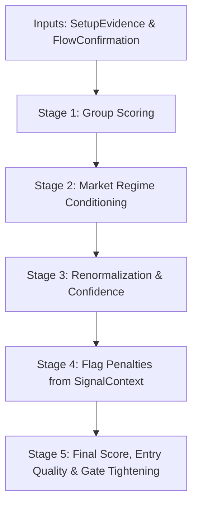

# Signal Engine Documentation (Phase 4/5 Staged Aggregation)

The `SignalEngine` is a core application service designed to calculate a composite timing score and entry recommendation (ENTER, WATCH, AVOID) for a stock ticker. 

To improve composition, avoid collinearity (double-counting), and support dynamic market conditioning, the engine uses a **staged, evidence-first group aggregation pipeline** (Phase 4/5) rather than a flat average of inputs.

---

## 1. Pipeline Quick Reference

| Stage | Description | Inputs | Key Calculations | Outputs |
| :--- | :--- | :--- | :--- | :--- |
| **Stage 1: Group Scoring** | Score the chart and institutional flow | Daily Price Candles, Broker Summaries, Bandar Detector | Setup Quality (60% weight) vs. Flow Confirmation (40% weight) | Setup score (0-100), Flow score (0-100) |
| **Stage 2: Market Regime** | Adjust scores based on market backdrop | Market Context | NEUTRAL / RISK_OFF / VOLATILE discounts | Conditioned group scores |
| **Stage 3: Renormalization** | Handle missing data dynamically | Present group weights | Base Score = Sum(Group Score * Weight) / Sum(Present Weights) | Base Score, Evidence Confidence (0.0 to 1.0) |
| **Stage 4: Flag Penalties** | Subtract fundamental risk penalties | Signal Context | Valuation, analyst, and insider penalties | Final opportunity score (0 to 100) |
| **Stage 5: Classification** | Determine recommendation | Score, Confidence, Regime | Strength (STRONG/MOD/WEAK) + Confidence -> Entry Quality (ENTER/WATCH/AVOID) | Final quality recommendation |

---

## 2. Architecture & Layer Boundaries

The system strictly enforces Hexagonal Architecture boundaries:
* **Domain Layer ([signal_assessment.py](file:///Users/satriyo/dev/ai-saham/src/domain/value_objects/signal_assessment.py), [setup_evidence.py](file:///Users/satriyo/dev/ai-saham/src/domain/value_objects/setup_evidence.py), [flow_confirmation_evidence.py](file:///Users/satriyo/dev/ai-saham/src/domain/value_objects/flow_confirmation_evidence.py)):** Defines the output contract (enums like `SignalStrength` and `EntryQuality`), the immutable calculation result (`SignalAssessment`), and the pure input facts (`SignalContext`, `SetupEvidence`, `FlowConfirmationEvidence`).
* **Application Layer ([signal_engine.py](file:///Users/satriyo/dev/ai-saham/src/application/services/signal_engine.py) & [assess_signal_evidence_use_case.py](file:///Users/satriyo/dev/ai-saham/src/application/use_case/assess_signal_evidence_use_case.py)):** Coordinates scoring weights and orchestration. Callers trigger evaluation via two entry points:
  * `evaluate()`: Self-fetches raw metrics from registered infrastructure ports (I/O path).
  * `evaluate_with_context()`: Executes a pure calculation pipeline using pre-loaded data. Used to prevent N+1 query performance degradation in bulk loops (e.g. screening 800+ tickers).
* **Infrastructure Layer:** Implements concrete database repositories and data provider ports (e.g., Bandar Detector, Analyst Consensus).
* **Adapter Layer:** Wires the providers and handles commands (e.g., CLI parsing).

---

## 3. Deep-Dive: The 5-Stage Scoring Pipeline



This section covers the deep-dives of how every stage functions under the hood.

---

## 4. Deep-Dive: Stage 1 - Group Scoring

In Stage 1, raw inputs are separated into two timing-critical groups: **Setup Quality** (Timing & Chart Structure) and **Flow Confirmation** (Volume & Smart Money).

### 1. Setup Quality (60% Weight)
Setup Quality measures whether the stock chart is in a valid trade setup window. It does *not* directly score raw technical indicators. Instead, it evaluates a set of **timing gates** to determine the overall score.

#### A. The Logic Flow (How the Score is Calculated)

```
[Price Candles]
       │
       ▼ (Calculate raw technical values)
[Technical Attributes: trend, rsi, bb_width_pctile, vwap_discount_pct, vwap_pct]
       │
       ▼ (Evaluate against setup gates in config/swing_setups.yaml)
[Individual Setups: foreign-bounce, coiled-spring, smart-money-confirmed, pullback-continuation]
       │
       ▼ (Classify each setup into MATCH, PARTIAL, or NO_MATCH)
[Best Match Selection: take the highest outcome among all enabled setups]
       │
       ▼ (Map to Match Strength)
[MATCH -> 100 | PARTIAL -> 60 | NO_MATCH -> 20]  ===> Setup Quality Group Score
```

1. **Calculate Technical Attributes:** The stock's daily candles are processed to compute the raw technical values (e.g. RSI, trend direction, Bollinger squeeze).
2. **Evaluate Setup Gates:** These values are checked against the rules defined in `config/swing_setups.yaml` for each enabled setup:
   * **`foreign-bounce`:** Gated on `min_vwap_discount_pct >= 3.0%`, `trend == SIDE`, and `rsi <= 60`.
   * **`coiled-spring`:** Gated on `bb_width_pctile <= 0.20` and `rsi <= 65`.
   * **`pullback-continuation`:** Gated on `trend == UP`, `rsi` between 40 and 65.
3. **Classify Matches:** For each setup, the candidate's gates are checked:
   * **`MATCH`:** 0 gates failed.
   * **`PARTIAL`:** Failed gates > 0 but <= configured `partial_max_failed_gates` (e.g., 2).
   * **`NO_MATCH`:** Failed gates > `partial_max_failed_gates`.
4. **Determine Best Match:** The final setup match is the highest classification achieved across any enabled setup.
5. **Map to Score:** The best match determines the Group 1 Score:
   * **`MATCH`** -> **`100.0`** points
   * **`PARTIAL`** -> **`60.0`** points
   * **`NO_MATCH`** -> **`20.0`** points

#### B. Technical Attributes Explained
These are the raw values computed from daily price candles that serve as inputs to the setup gates:

* **Trend (`trend`):**
  * *What it is:* A classification of the stock's short-term direction relative to its 20-day Simple Moving Average (SMA).
  * *How it is calculated:*
    1. Computes the 20-day SMA: `SMA = Sum(candle.close) / 20`.
    2. Calculates the percentage difference: `pct_diff = (current_price - SMA) / SMA * 100`.
    3. Categorizes direction based on a 2.0% threshold: `pct_diff > 2.0%` -> `"UP"`, `pct_diff < -2.0%` -> `"DOWN"`, else `"SIDE"`.
* **RSI (`rsi`):**
  * *What it is:* Wilder's Relative Strength Index over a 14-day lookback, measuring momentum velocity.
  * *How it is calculated:* Smoothes the 14-day gains and losses using Wilder's smoothing technique: `Avg Gain = (Prev Avg Gain * 13 + Current Gain) / 14`. Computes `RS = Avg Gain / Avg Loss`, and maps `RSI = 100 - (100 / (1 + RS))`.
* **Bollinger Band Squeeze (`bb_width_pctile`):**
  * *What it is:* A percentile score (0.0 to 1.0) showing the tightness of the current price range relative to the past 60 trading days.
  * *How it is calculated:* Computes daily Bollinger Band Width: `BB Width = (Upper - Lower) / SMA * 100`. Compares the current day's width against the past 60 days: `bb_width_pctile = (Count of days where width <= current_width) / 60`. `0.0` means tightest range in 60 days (squeeze).
* **VWAP Discount (`vwap_discount_pct`):**
  * *What it is:* The percentage discount of the current price relative to the average price paid by foreign institutional investors.
  * *How it is calculated:* Sums the total Rupiah value transacted by foreigners divided by total shares bought during the lookback: `Foreign VWAP = Sum(foreign_buy_value) / (foreign_buy_lots * 100)`. Discount is: `vwap_discount_pct = (Foreign VWAP - current_price) / current_price * 100`. A positive value indicates foreigners' average cost is above the current price.
* **Market VWAP Percentage (`vwap_pct`):**
  * *What it is:* The percentage difference between the current price and the 20-day all-participant market VWAP.
  * *How it is calculated:* Daily Typical Price: `TP = (High + Low + Close) / 3`. Computes 20-day Volume-Weighted Average Price: `Market VWAP = Sum(TP * Volume) / Sum(Volume)`. Distance: `vwap_pct = (current_price - Market VWAP) / Market VWAP * 100`.

#### C. Guard-Gated Sub-Signals
* **Relative Strength vs. IHSG (`rs_vs_ihsg_5d`):** Compares the 5-day return of the stock against the benchmark index. This is **date-gated** (only active on or after 2025-07-01 when benchmark candles are complete; otherwise returns `None` / `MISSING`).
* **Volume Trend (`volume_trend_ratio`):** Computes the 5-day average volume relative to the 20-day average. This is **source-gated** (only evaluated when the candle source is `"stockbit"`; if using Yahoo candles, volume is marked `None` / `MISSING` due to Yahoo's unreliable volume fields).

#### D. Impact in Signal Engine
Setup Quality acts as the primary timing driver in the Engine (carrying **60%** of the opportunity score):
* A `MATCH` (100) contributes **60.0 points** to the opportunity score.
* A `PARTIAL` (60) contributes **36.0 points** to the opportunity score.
* A `NO_MATCH` (20) contributes **12.0 points** to the opportunity score.

---

### 2. Flow Confirmation (40% Weight)
The flow confirmation group measures institutional presence. The score (0 - 100) is computed from the `FlowConfirmationEvidence` object.

#### A. The Logic Flow (How the Score is Calculated)

```
[Smart Money & Institutional Inputs]
   ├── Foreign Flow Data (Consistency, Streak, VWAP, Avg Flow, BCI)
   └── Bandar Detector Data (Broker Accumulation/Distribution broad_score)
                 │
                 ▼ (Calculate sub-signal strengths)
   ├── Foreign Flow Strength = (cons + streak + vwap + flow + inst) / 115.0
   └── Bandar Strength = (broad_score + 12.0) / 24.0
                 │
                 ▼ (Combine and average the two strengths)
   [Uncapped Strength = (Foreign Flow Strength + Bandar Strength) / 2]
                 │
                 ▼ (Apply 0.80 ceiling cap to prevent outliers)
   [Capped Strength = Min(Uncapped Strength, 0.80)]
                 │
                 ▼ (Scale to 0 - 100 range)
   [Flow Confirmation Score = Capped Strength * 100.0] ===> Flow Confirmation Group Score
```

1. **Calculate Strength Dimensions:**
   * **Foreign Flow Strength (0.0 to 1.0):** Evaluates the consistency, streak, VWAP discount, volume ratio, and BCI classifications of foreign brokers, summing to a max of 115 points and dividing by 115.0.
   * **Bandar Strength (0.0 to 1.0):** Maps the local market broker net balance score (-12 to +12) to a positive decimal scale.
2. **Average Strengths:** Computes the arithmetic average of the two active strengths.
3. **Apply Security Cap:** Caps the combined strength at a ceiling of `0.80` to protect the portfolio from single-day anomalous volume spikes.
4. **Scale to Score:** Multiplies the capped strength by `100.0` to produce the final Group 2 Score (0.0 to 80.0).

---

#### B. Foreign Flow Strength Sub-Signals
The Foreign Flow Strength is calculated by summing **five distinct sub-signals** and normalizing them against a ceiling of **115 points**:
* **Foreign Flow Strength** = (cons + streak + vwap + flow + inst) / 115.0

* **Consistency (`cons`) — Max 40.0 pts:** 
  * Score = Clamp(net_buy_ratio, 0.0, 1.0) * 40.0
  * *Where `net_buy_ratio` is the proportion of trading days where foreign investors were net buyers.*
* **Streak (`streak`) — Max 30.0 pts:** 
  * Score = 30.0 * (1 - e^(-streak / 7.0))
  * *Measures consecutive net buying days using an exponential saturation curve.*
* **VWAP Discount (`vwap`) — Max 20.0 pts:** 
  * Score = Clamp(vwap_discount_pct / 10.0, 0.0, 1.0) * 20.0
  * *Rewards stocks trading at a discount relative to the foreign volume-weighted average price.*
* **Foreign Flow Ratio (`flow`) — Max 10.0 pts:** 
  * Score = Clamp(avg_flow_ratio / 20.0, 0.0, 1.0) * 10.0
  * *Measures foreign net purchase volume relative to the total traded volume.*
* **BCI Broker Concentration (`inst`) — Max 15.0 pts:** 
  * Maps BCI labels to points: `"CLUSTER"` -> 15.0 points, `"STABLE"` -> 5.0 points, others -> 0.0 points.

---

#### C. Bandar Strength
Maps the local Bandar broad score (ranging from -12 to +12) to a 0.0 - 1.0 decimal:
* **Bandar Strength** = (Broad Score + 12.0) / 24.0

---

#### D. Impact in Signal Engine
Flow Confirmation validates institutional commitment (carrying **40%** of the opportunity score):
* A perfect score (80.0) contributes **32.0 points** to the opportunity score.
* A weak score (e.g., 30.0) contributes **12.0 points** to the opportunity score.

---

## 5. Deep-Dive: Stage 2 - Market Regime Conditioning

Market conditions act as a dynamic hurdle rate for setups and volume confirmation. This stage runs inside the use case, modifying the Stage 1 group scores before renormalization based on the current `MarketContext` regime.

### 1. RISK_OFF Regime: Discounting Weak Setups
In a bearish market backdrop, timing must be impeccable. Standard or marginal setups are discounted.
* **Under the Hood:** If the setup score is less than the `weak_setup_threshold` (default `60.0`, corresponding to `PARTIAL` or `NO_MATCH` setups), the score is multiplied by the `weak_setup_discount` (default `0.50`).
* **Logic:** 
  * If Setup Quality score is `60.0` (`PARTIAL`), it is halved to `30.0`.
  * If Setup Quality score is `100.0` (`MATCH`), it remains `100.0`. 
  * This ensures only high-conviction setup configurations survive down-trending markets.

### 2. NEUTRAL Regime: Discounting Weak Flow
In a choppy or sideways market, entries must be backed by aggressive buying commitment.
* **Under the Hood:** If the flow score is less than the `weak_flow_threshold` (default `50.0`), the score is multiplied by the `weak_flow_discount` (default `0.80`).
* **Logic:** Weak institutional buying gets penalized by 20%, forcing the engine to wait for clustered accumulation (`CLUSTER` or high streak) to trigger entries.

### 3. VOLATILE Regime: Double discounting
In high-volatility environments (high VIX or rapid intraday moves), setups and flows decay rapidly.
* **Under the Hood:** Both scores are discounted unconditionally.
  * Setup score is multiplied by `setup_discount` (default `0.70`).
  * Flow score is multiplied by `flow_discount` (default `0.80`).
* **Logic:** This raises the absolute entry bar for both parameters to absorb volatility risk and prevent premature stop-outs.

### 4. RISK_ON Regime
No conditioning is applied. The group scores remain at their raw values.

---

## 6. Deep-Dive: Stage 3 - Renormalization & Confidence

To handle missing API metrics dynamically, the engine uses a **No-Neutral-Fill** policy during Stage 3. Rather than filling missing data with a fake neutral score of 50.0 (which dilutes strong signals), missing groups are completely excluded from the calculation.

### 1. The Normalization Math
Under the hood, the weights of the *actually present* groups are used as the denominator.
* Setup Quality has a target weight of `0.60`.
* Flow Confirmation has a target weight of `0.40`.

#### Scenario A: Both Groups Present
* Present Weights = 0.60 + 0.40 = 1.00
* Base Score = (Setup Score * 0.60 + Flow Score * 0.40) / 1.00
* Confidence = 1.00 / 1.00 = 1.00 (100% complete evidence)

#### Scenario B: Setup Quality Only (Flow is Missing)
* Present Weights = 0.60
* Base Score = (Setup Score * 0.60) / 0.60 = Setup Score
* Confidence = 0.60 / 1.00 = 0.60 (60% evidence completeness)

#### Scenario C: Flow Confirmation Only (Setup is Missing)
* Present Weights = 0.40
* Base Score = (Flow Score * 0.40) / 0.40 = Flow Score
* Confidence = 0.40 / 1.00 = 0.40 (40% evidence completeness)

#### Scenario D: Both Groups Missing
* Base Score = 50.0 (Fallback flat default)
* Confidence = 0.00 (0% evidence completeness)

### 2. Design Implications
If a stock has a perfect setup score of `100.0` but lacks fresh flow data, its Base Score remains `100.0` rather than being dragged down to `80.0` by a neutral fill. However, the confidence score drops to `0.60`, which prevents it from being classified as an `ENTER` quality trade (which requires high confidence).

---

## 7. Deep-Dive: Stage 4 - Flag Penalties (Asymmetric Checks)

Stage 4 evaluates fundamental and analyst context from the `SignalContext` object. These act as **asymmetric risk flags**—they can only penalize a stock's score, never increase it.

### 1. Flag Thresholds & Penalties Under the Hood
* **VALUATION_STRETCHED (Penalty: -10 pts):**
  * Trigger: `forward_pe > 50.0`
  * Action: Reduces the composite score by 10 points. High P/E growth stocks or loss-makers with extreme multiples are penalized.
* **ANALYST_BEARISH (Penalty: -8 pts):**
  * Trigger: `analyst_buy_pct < 0.20` (Less than 20% of analysts recommend a Buy).
  * Action: Reduces the composite score by 8 points.
* **INSIDER_SELLING (Penalty: -12 pts):**
  * Trigger: `insider_net_buy_ratio < -0.30` (Insider selling volume exceeds buying volume by more than 30% over the last 90 days).
  * Action: Reduces the composite score by 12 points.

### 2. Score Reduction Math
Penalties are cumulative. If a stock is trading at P/E of 60 (-10 pts) and has heavy insider selling (-12 pts), the total flag adjustment is `-22` pts.
* **Calculation:**
  $$\text{Final Score} = \text{Max}(0, \text{Min}(100, \text{Base Score} - \text{Total Flag Penalties}))$$

---

## 8. Deep-Dive: Stage 5 - Entry Classification & Gate Tightening

This stage maps the final composite score to a trade recommendation and applies portfolio-level risk overrides.

### 1. Signal Strength Classification
First, the engine classifies the stock's score into a strength level:
* Score >= 70: `STRONG`
* Score >= 45: `MODERATE`
* Score < 45: `WEAK`

### 2. Entry Quality Assignment
Second, the engine evaluates both **Signal Strength** and **Evidence Confidence** to determine the final entry classification:
* **`ENTER`:** Requires a `STRONG` signal AND `Confidence >= 0.70` (Requires both groups to be present).
* **`WATCH`:** Requires `STRONG` or `MODERATE` signal AND `Confidence >= 0.40` (Requires at least one group to be present).
* **`AVOID`:** Any other combination (e.g. if the score is `85` but confidence is only `0.40`, it is downgraded to `WATCH` due to incomplete evidence).

### 3. Gate Tightening Override
If the market context indicates unstable macro conditions, a portfolio override can be triggered:
* **Under the Hood:** If `market_context.gate_tightening` is `True` and the computed entry quality is `ENTER`, it is automatically capped and downgraded to `WATCH`.
* **Logic:** This acts as an automated risk gate during turbulent market weeks, preventing the screener from outputting aggressive buy signals when the broad index is collapsing.

---

## 9. Concrete End-to-End Walkthrough (Ticker: BBRI)

To see how this works under the hood, let's trace a mock analysis of **BBRI** on a day when the market regime is **`RISK_OFF`** with **`gate_tightening` active**:

### Step 1: Technical Attributes & Setup Gates
* **Inputs:**
  * BBRI price close is below the 20-day foreign VWAP, giving a `vwap_discount_pct` of `4.5%`.
  * `trend` is `"SIDE"`, `rsi` is `55`.
  * `bb_width_pctile` is `0.15` (volatility compressed).
* **Setup Gating:**
  * Checked against `coiled-spring` setup gates:
    * `max_bb_width_pctile` (0.15 <= 0.20) -> **Pass**
    * `max_rsi` (55 <= 65) -> **Pass**
    * `min_foreign_flow_score` (75 >= 60) -> **Pass**
  * All gates pass -> classified as a **`MATCH`**.
  * **Setup Group Score** = **`100.0`** (Match).

### Step 2: Flow Confirmation Scoring
* **Inputs:**
  * Foreign investors net bought on 6 out of 10 days (`net_buy_ratio` = 0.60).
  * BCI label is `"CLUSTER"` (strong Tier 1 foreign broker buying).
  * Streak is 2 days.
  * Average flow ratio is 8.0%.
* **Sub-Signal Scoring:**
  * `cons` = 0.60 * 40.0 = 16.0
  * `streak` = 30.0 * (1 - e^(-2 / 7)) = 7.5
  * `vwap` = (4.5 / 10.0) * 20.0 = 9.0
  * `flow` = (8.0 / 20.0) * 10.0 = 4.0
  * `inst` = 15.0 (Cluster)
  * Sum of flow sub-signals = 16.0 + 7.5 + 9.0 + 4.0 + 15.0 = 51.5.
  * *Foreign Flow Strength* = 51.5 / 115.0 = 0.4478.
  * *Bandar Strength* (Broad score = +2) = (2 + 12) / 24 = 0.5833.
  * *Combined Uncapped Strength* = (0.4478 + 0.5833) / 2 = 0.5156.
  * *Capped Strength* = Min(0.5156, 0.80) = 0.5156.
  * **Flow Confirmation Score** = 0.5156 * 100 = **`51.56`**.

### Step 3: Market Regime Conditioning
* The regime is **`RISK_OFF`**.
* Under `RISK_OFF`, only weak setup scores (< 60) are discounted. Since BBRI's setup score is `100.0`, it is **not discounted**.
* Conditioned Setup Score = **`100.0`**.
* Conditioned Flow Score = **`51.56`**.

### Step 4: Renormalization
* Both groups are present.
* Base Score = (100.0 * 0.60 + 51.56 * 0.40) / 1.00 = 60.0 + 20.62 = **`80.62`**
* Confidence = 1.00 / 1.00 = **`1.00`**

### Step 5: Flag Penalties
* BBRI's Forward P/E is 14.0 (no valuation penalty).
* Polled analysts Buy ratio is 90% (no bearish consensus penalty).
* However, insider net buy ratio is -0.45 (insider selling triggers **`INSIDER_SELLING`** flag).
* Total penalty = **`-12` pts**.
* **Final Score** = Max(0, Min(100, 80.62 - 12)) = round(68.62) = **`69`**.

### Step 6: Classification & Override
* Final Score = `69` -> mapped to **`MODERATE`** strength (threshold for STRONG is 70).
* Since Strength is `MODERATE` and Confidence is `1.0`, the baseline entry classification is **`WATCH`** (requires `STRONG` for `ENTER`).
* *Even if the score had been >= 70, the active `gate_tightening=True` flag would have capped the ENTER verdict to `WATCH`.*
* **Final Verdict:** **`WATCH`** (Score: 69, Confidence: 1.00, Insider selling warning active).

---

## 10. The Legacy AssessSignalUseCase class

The old flat 6-factor calculation is preserved as a separate class inside [assess_signal_use_case.py](file:///Users/satriyo/dev/ai-saham/src/application/use_case/assess_signal_use_case.py). 

> [!IMPORTANT]
> The active `SignalEngine` and `AssessSignalEvidenceUseCase` **never** run this fallback under the hood. If no evidence groups are supplied to the modern pipeline, it marks both groups as `MISSING` (denoting `base_score = 50.0` and `confidence = 0.0` in Stage 3 renormalization) rather than executing the legacy factor average.
>
> The legacy `AssessSignalUseCase` class is kept in the codebase exclusively for:
> 1. Running legacy baseline tests.
> 2. The `AuditSignalUseCase` (`saham signal audit` command) to produce exact factor-by-factor comparisons between the legacy behavior and the new staged engine.

### Legacy Scoring Formula
```
Score = (0.20 * Bandar) + (0.20 * ForeignFlow) + (0.20 * Insider) + (0.15 * Seasonality) + (0.15 * Analyst) + (0.10 * Valuation)
```

### Legacy Factor Normalization Tiers
* **Bandar Intensity:** Maps raw broad score (`[-max_range, +max_range]`) to 0.0 - 100.0.
* **Foreign Flow:** Multiplies the raw pre-normalized 0.0 to 1.0 ratio by 100.0.
* **Insider Activity:** Net transaction buy ratio `[-1.0, +1.0]` mapped to 0.0 - 100.0.
* **Seasonality Edge:** Win rate mapped to `win_rate_pct` if in a Tailwind/Headwind month, else 50.0.
* **Analyst Consensus:** `(buy_ratio * 60) + ((upside_pct / 30) * 40)` (upside capped at 30%).
* **Forward Valuation:** Non-linear interpolation of Forward P/E:
  * P/E <= 10 -> 95.0
  * P/E <= 15 -> 75.0
  * P/E <= 20 -> 50.0
  * P/E <= 30 -> 25.0
  * P/E > 30 -> exponential decay to 0.

---

## 11. Data Source Cache Tables

Data is populated in local SQLite cache tables (`data/db/data.db`) via Stockbit Exodus API fetches or Yahoo Finance:

| Data Group | SQLite Table | Ingested Via |
| :--- | :--- | :--- |
| **Candles** | `candles` | Yahoo Finance / Stockbit |
| **Foreign Flow** | `foreign_flow_points` | Stockbit Exodus API |
| **Bandar Activity** | `bandar_detector` | Stockbit Exodus API |
| **Insider Activity** | `insider_cache` | Stockbit Exodus API |
| **Seasonality** | `seasonality_cache` | Stockbit Exodus API |
| **Analyst Consensus** | `analyst_cache` | Stockbit Exodus API |
| **Valuations** | `forward_estimates_cache` | Stockbit Exodus API |
| **Market Regime** | `market_context_snapshots` | IDX/Stockbit/Macro |
